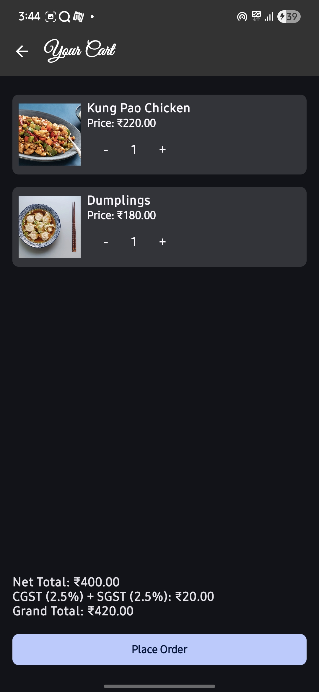

# 🍽️ Cravory - Restaurant Food Ordering App

Cravory is a modern Android food ordering app that allows users to explore cuisines, browse dishes, and place food orders seamlessly. Built with Kotlin and Jetpack Compose, Cravory delivers a smooth, responsive, and visually appealing user experience.

---

## 🚀 Features

- 🔍 **Explore Cuisines** – Browse a variety of cuisine categories.
- 🥘 **View Dishes** – See dish details including price, rating, and image.
- ➕ **Add to Cart** – Add dishes to your cart with adjustable quantities.
- 🛒 **Cart Management** – View and manage your selected items.
- 🌐 **Live API Integration** – Integrates with OneBanc's UAT APIs.
- 🈳 **Language Switch** – Toggle languages for better accessibility.
- ⚠️ **Robust Error Handling** – Handles API failures and invalid states gracefully.
- 📱 **Jetpack Compose UI** – Modern, declarative Android UI toolkit.

---

## 📸 Screenshots

<div align="center">

<table>
  <tr>
    <td></td>
    <td></td>
  </tr>
  <tr>
    <td></td>
    <td></td>
  </tr>
</table>

</div>

---

## 🎥 Demo

> 🎬 Here's a live screen recording of the app in action:


---

## 🛠️ Tech Stack

- **Language**: Kotlin  
- **UI Framework**: Jetpack Compose  
- **Architecture**: MVVM  
- **Networking**: HttpURLConnection  
- **State Management**: LiveData, ViewModel  
- **Image Handling**: Bitmap from URL  
- **Design**: Material 3 Components  

---

## 📦 API Endpoints

The app communicates with OneBanc’s UAT APIs:

- `get_item_list` – Fetch all available dishes  
- `get_item_by_filter` – Filter dishes by cuisine  
- `get_item_by_id` – Get detailed dish info  
- `make_payment` – Submit cart for order (WIP)  

---

## 🧪 How to Run

1. Clone the repo:
   ```bash
   git clone https://github.com/NeelSaurikh/Cravory.git
